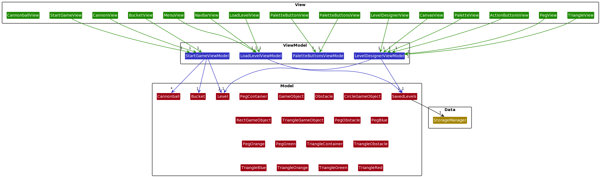
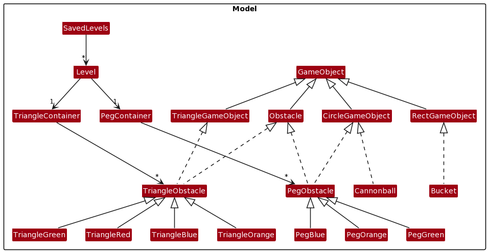
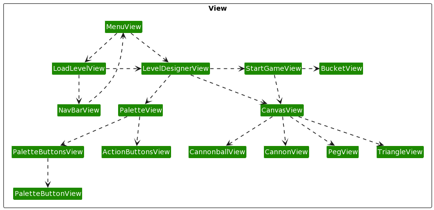
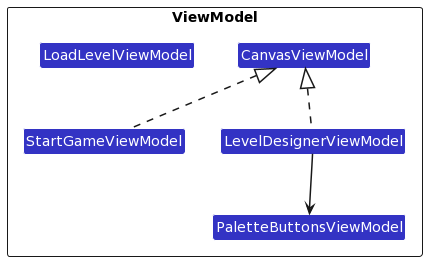
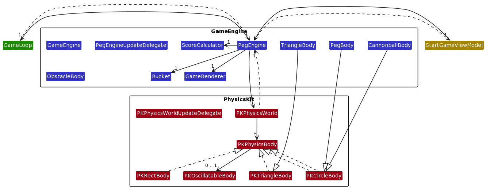
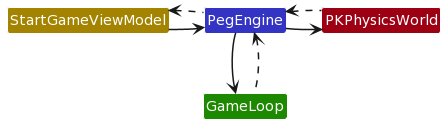
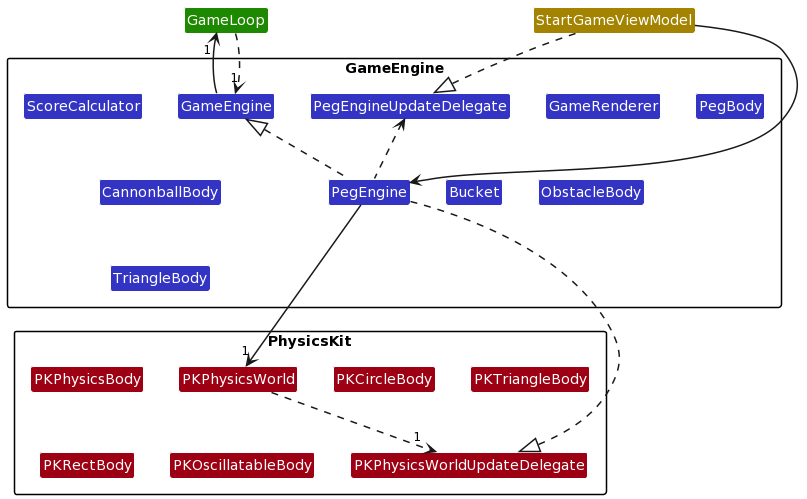

# PEGGLE 

This project is a clone of the popular game Peggle.

## HOW TO PLAY

### Gameplay

#### Cannon Direction

To aim the cannon, hold and drag any part of the screen. 

In order to shoot the cannon, similarly, tap almost any part of the screen. The cannon will shoot the ball towards where it is currently aiming based on where you dragged it.

#### Win and Lose Conditions

To win the game, before the timer runs out, clear all orange obstacles (pegs and triangles) with the cannonballs that you have.

There are 2 ways to lose the game:
1. Run out of time (1 minute 45 seconds) before clearing all the orange obstacles
2. Run out of cannonballs (10 cannonballs at the start    ) before clearing all the orange obstacles

Note:
* If your cannonball is still in play (on the screen) when the timer runs out, the game will check if you have already hit all the remaining orange obstacles. 
    * If you did, you won the game
    * If you did not, you lost the game
    
### Level Designer

#### Peg Resizing

To resize the pegs, tap on the resize button (the most left button in the palette). After which, you can drag the pegs to increase or decrease their size. To increase their size, drag away from the peg's center. To decrease their size, drag the peg towards its center. For triangular obstacles, when you drag away from its center vertically, it will increase in height. When you drag away from its center horizontally, you will increase its width. Any combination of these 2 gestures will result in the expected combination of their effects, producing irregular triangular shaped blocks. 

#### Adjusting oscillation of blocks

As explained further down in my Model explanations below, I have block obstacles and non-block obstacles. All the pegs, as well as the blue, orange and green triangles are all non-block obstacles. The red triangles are block obstacles. Only block obstacles are oscillatable (although my code allows for making any obstacle oscillatable). Thus, only the red triangles can oscillate. To adjust oscillation, after placing the red triangles on the canvas, you will be able to see a black circle around each red triangle. The black circle indicates that it will not oscillate. To make it oscillate, *unselect every button*, then drag the red trangle. Dragging aray from the red triangle makes the circle bigger, while draggin towards the triandle makes the circle smaller. Note that you have to perform the dragging gesture on the triangle, not on the circle itself (the circle will accordingly match to your fingers). Additionally, as an indication that the red triangle will now oscillate, the circle surrounding it turns red. 

Note: Larger circle indicates less springy in my implementation.

### Scoring system

#### Base scores

These are the base scores of each obstacle:
* Blue obstacle: 10 points
* Green obstacle: 10 points
* Orange obstacle: 100 points

The total base score of a shoot follows the following formula, which is accurate to the real game Peggle: 

Let the number of blue obstacles hit be `b`

Let the number of green obstacles hit be `g`

Let the number of orange obstacles hit be `o`

(`b` x 10 + `g` x 10 + `o` x 100) x (`b` + `g` + `o`)

#### Multipliers

This base score will be multiplied based on the number of remaining orange obstacles:
* No remaining orange obstacles left: 100x
* 1-3 orange obstacles left: 10x
* 4-7 orange obstacles left: 5x
* 8-10 orange obstacles left: 3x
* 11-15 orange obstacles left: 2x
* At least 16 orange obstacles left: 1x

The multiplier is applied on each hit of an obstacle, based on the number of remaining (non-hit) orange obstacles left at the time of the hit. For example, if the player starts with a 1x multiplier and 16 orange obstacles left, suppose the ball hits a blue obstacle, and then hits an orange obstacle (changing the multiplier to 2x) before hitting another blue obstacle and going down out of bounds. The total score will then be calculated as:

(1 x 10 + 1 x 100 + 2 x 10) x 3 = 390

## Dev Guide

### High Level Architecture

The project is organised using a Model-View-ViewModel (MVVM) architecture pattern. The image above shows how each component references one another. As can be seen, the `View` watches the `ViewModel`, and the `ViewModel` will provide the `View` with the appropriate `Model` elements. I will be explaining below what each of the components are made up of.

### Model 

My Model starts with the `SavedLevels`, which has a reference to a number of `Level`s. Each `Level` will hold collections of obstacles. For instance, each `Level` holds a `PegContainer`, which are a collection of `PegObstacles`s, and a `TriangleContainer`, which are a collection of `TriangleObstacle`s. `PegObstacle` class purely refer circular obstacles, and `TriangleObstacle`s are triangular obstacles, both of which conform to the `Obstacle` protocol. `Obstacle` in my model refers to game objects that the cannonball collide with, excluding the bucket and the edges of the screen. It provides all methods needed for being an obstacle, including intersection methods and oscillation-related methods. Obstacles can either be blocks or not. Blocks are purely obstacles that the cannonball bounces off in a realistic manner. Non-block obstacles are obstacles that will glow up, provide points, provide power ups, etc.

The `PegObstacles`s that the `PegContainer` contain include `PegBlue`, `PegOrange` and `PegGreen`, all of which inherits from `PegObstacle`. `PegObstacle` and `Cannonball` are both circular game objects, and thus implement the protocl `CircleGameObject`. Similarly, `TriangleContainer` contains `TriangleBlue`, `TriangleOrange`, `TriangeGreen`, and `TriangleRed`, all of which are derived classes from `TriangleObstacle`. Also similarly, `TriangleObstable`, being a triangular game object, conforms to the `TriangleGameObject` protocol. As mentioned earlier, I have an `Obstacle` in my model as well. There is also a `Bucket` class, which conforms to the `RectGameObject` protocol. Lastly, `CircleGameObject`, `TriangleGameObject` and `RectGameObject` all inherits from `GameObject`. In the future, there could be other shapes of `GameObjects`, so this structure would make it easy to extend, as any future shaped objects will inherit from `GameObject`.

### View

Upon opening the app, the user will start at the `MenuView`. Here, there are options for the user to navigate to either the `LevelDesignerView` by choosing to design a new level, or to go to the `LoadLevelView` to load previously saved levels.

 The `LoadLevelView` is mainly responsible in showing the user all `Level`s currently saved in the app. This view is made up of all the saved `Level`s shown as NavigationLinks in a list, as well as some buttons on the navigation bar presented by a `NavBarView`. The `NavBarView` consists of 2 buttons: A "Return To Start Menu" button (self-explanatory), and a "Delete All Levels" button (to delete all non-preloaded levels).

The main view involved in level design is called `LevelDesignerView`. It consists of 2 views, a `CanvasView` and a `PaletteView`. The `CanvasView` is responsible for the canvas, such as its background image, as well as any actions performed on it, for instance tapping pegs, long-pressing pegs, tapping the background image, and more. As a result, the `CanvasView` is actually used by both the `LevelDesignerView` and the `StartGameView`. The `CanvasView` uses generic methods like `backgroundOnTapGesture` and `obstacleOnTapGesture` so that different views can use the same canvas, and have View Models that implement different logic for these methods. This increases reusability of my code.
 
 The `PaletteView` consists of the `PaletteButtonsView` and the `ActionButtonsView`. The `PaletteButtonsView` is responsible for presenting the peg buttons on the palette, as well as the delete and resize button. Each of these buttons are actually represented by a `PaletteButtonView`. The `ActionButtonsView` presents actions buttons such as "BACK", "SAVE", "RESET", "START", as well as the textfield that showcases the current level name (if it has one), and gives the user an avenue input the level name that it will be saved as. The "BACK" button from the `LevelDesignerView` will lead the user back to the previous view, which is ether the `LoadLevelView`, or the `MenuView`, while the "START" button will navigate to the `StartGameView`, as one would expect.

 Additionally, pegs will be represented by the `PegView`. When creating a `PegView`, a colour has to be specified (by choosing from an enum) so that the image of the `PegView` can be chosen. Currently, the choices include `blue`, `orange`, `green`, `blueGlow`, `orangeGlow`, and `greenGlow`. To add to that,a there is also the `TriangleView`. Other than pegs that are needed to be shown on the canvas, since the canvas is used in the `StartGameView` as mentioned earlier, cannonballs and the cannon could appear too. Cannonballs are represented by the `CannonballView`, while the cannon is represented by `CannonView`.
 
 Lastly, we have the `StartGameView`, which uses the same `CanvasView` mentioned in prior paragraphs. This view is responsible for rendering the game while it is being played. Furthermore, it holds the `BucketView`, which is the view responsible for representing the buclet. It also has a button that will allow the user to stop playing the game at any time, and return to the `LevelDesignerView`.
 
 Other shared views include a `ButtonView`, for a specifically styled button, a `NavLinkButtonView`, which are buttons styled similarly to `ButtonView`, but act as navigation links, and a `TextFontView`, which consist of text styled in a specific way. These shared views are used by a plethora of views, and thus would serve no purpose being shown in the dependency diagram above.

### View Model

My ViewModel currently consists of 4 classes and a protocol. Firstly, there is a view model responsible for the views involed in loading levels and showing all the saved levels called `LoadLevelViewModel`. The view model responsible for the views involved in level design is called `LevelDesignerViewModel`, and the view model responsible for the views involved in the game while it is being played is called the `StartGameViewModel`. As mentioned a few times, both the `LevelDesignerView` (controlled by `LevelDesignerViewModel`) and the `StartGameView` (controlled by `StartGameViewModel`) uses the `CanvasView`, just with different implementations of its generic methods. Thus, both the `LevelDesignerViewModel` and the `StartGameViewModel` inherits from `CanvasViewModel`, which determines the blueprint of what kind of generic methods that the view models have to override. Seeing as it has to be a view model that are watched by views, the `CanvasViewModel` has to conform to `ObservableObject`, and thus had to be a class and not a protocol. Additionaly, `LevelDesignerViewModel` also has reference to a `PaletteButtonsViewModel`. The `PaletteButtonsViewModel` is purely responsible for the logic of selection of buttons in the `PaletteView`.

### Physics

Above shows the highest level picture of the interactions between the phyiscs kit and the game engine.
Since physics is involved in the game while it is in play, the `StartGameViewModel` is the entry point into the physics of the game. There are 2 main components, the `GameEngine` and the `Physics Kit` (or `PK` for short). I will be explaining each component in more detail below.

### Physics Kit (PK)

The Physics Kit was written to be general, and to be able to be reused in other projects that required physics. Thus, it does not have any methods relating to peggle, and is simply involved in calculations. The top level class would be the `PKPhysicsWorld`, and it contains a collection of `PKPhysicsBody`. `PKPhysicsWorld` is the class that exposes its methods to any projects that desires to use this physics kit. Its main method would be the `simulatePhysics` method, which should be called at every step of a game loop. This method is involved in calculating and applying the new positions and velocities of all `PKPhysicsBody`s, resolving their collisions, as well as marking any objects that should be destroyed. It does not directly remove the objects so that any client of this physics kit has the liberty of handling how or when the objects should be destroyed.

The `simulatePhysics` method works as follows: 

`updatePhysicsBodies` -> `getPhysicsBodyAndCollisionVelocityPairs` -> `resolveBodyCollisions` -> `resolveEdgeCollisions` -> `destroyOutOfBoundBodies`

`updatePhysicsBodies`: Updates the velocity and position of all the `PKPhysicsBody` contained in the `PKPhysicsWorld` based on their current velocity, current position, as well as gravity.

`getPhysicsBodyAndCollisionVelocityPairs`: Iterates through all the `PKPhysicsBody` contained in the `PKPhysicsWorld`, and checks whether any of the dynamic physics bodies are intersecting with any other `PKPhysicsBody`. If so, form a 2 element tuple containing a `PKPhysicsBody`, as well as their resultant collision velcoties. An collection of these tuples will be returned by this method.

`resolveBodyCollisions`: Iterate through the tuple collection from the previous method, and update the `PKPhysicsBody`s with their new velocities if they are dynamic.

`resolveEdgeCollisions`: Iterate through all the `PKPhysicsBody` and check if they are intersecting with the bounds of the `PKPhysicsWorld` (which are passed in as a parameter to `PKPhysicsWorld` when intialising). If so, update their velocities in the opposite direction of the edge.

`destroyOutOfBoundBodies`: If any `PKPhysicsBody` gets out of bounds, mark them to be destroyed.

As mentioned earlier, `PKPhysicsWorld` contains a collection of `PKPhysicsBody`s. These are bodies that will be affected by physics. `PKPhysicsBody` is a protocol, and has physical properties such as mass, velocity and position, amongst others, as well as having methods such as `isIntersecting`. Currently, there are three classes that conforms to `PKPhysicsBody`, which are the `PKCircleBody`, `PKRectBody`, and the `PKTriangleBody`. Apart from the properies that all `PKPhysicsBody` posses, the `PKCircleBody` has the additional `radius` and `diameter` properties, as well as their own implementation of `isIntersecting`. The more important additional properties that `PKRectBody`s possess are `width` and `height`, which represent the width and height of the Rectagle Body. As for the last derivation of `PKPhysicsBody`, which is the `PKTriangleBody`, it has additional properties such as a collection of edges, where each edge is represented by the shared struct `Line`. In the future, there may be other shapes of physics bodies that would conform to `PKPhysicsBody`. 

An additional property that is important to `PKPhysicsBody` is the `oscillatableBody` property. It is an reference to an optional of the `PKOscillatableBody` class. It acts almost like a `PKPhysicsBody` decorator, where `PKPhysicsBody` objects that have a non-nil reference to a `PKOscillatableBody` means that it is gains oscillatable properties, and have access to methods that simulate oscillation. This was inspired by SwiftUI's `SpriteKit`, where there exists `SKNodes`, and in order to apply physics simulation to the node, you have to assign a `SKPhysicsBody` object to the `physicsBody` property of the `SKNode`. To make the inspiration clear, in order to apply oscillation physics simulation to my physics body, I have to assign a `PKOscillatableBody` object to the `oscillatableBody` property of the `PKPhysicsBody`. Additionally, the `PKOscillatableBody` object will also keep a weak reference to its owning `PKPhysicsBody`. As such, the calculations can be carried out using the owning physics body's mass, velocity, position, etc.

There is also a `PKPhysicsWorldUpdateDelegate` protocol of which `PKPhysicsWorld` has a weak reference to. It will have specific methods that can be called after certain updates in `PKPhysicsWorld`, to notify any specific updates that a user of `PKPhysicsWorld` might want to know. For example, there is the `didDestroyOutOfBoundBodies` method. This method is used to tell the game engine when the cannonball has been destroyed after going out of bounds. I implemented this method in the delegate such that only after being updated of this scenario would I then go on to destroy all the lighted up pegs.

### Game Engine

Firstly, there is a `GameLoop` class solely responsible for calling the `update` and `render` method of a `GameEngine` every step. It forms a strong weak cycle with a `GameEngine`, which is a protocol that contain the `update` and `render` methods. This is so that I can make use of this `GameLoop` for other `GameEngines` as well, not just specifically for the peggle game engine. Speaking of which, the game engine that I am using for peggle and that conforms to `GameEngine` is called `PegEngine`. It contains implementations of the `update` and `render` methods. 

The main method it uses in its `update` method is `simulatePhysics` method of `PKPhysicsWorld`, which has already been explained. The `PegEngine` also has a reference to a `PegEngineUpdateDelegate`. The `PegEngineUpdateDelegate` contains many methods such as `didUpdatePegEngine`, `didAddNewGameObject`, `didWinGame`, `didLoseGame`, to name a few. All classes that use the `PegEngine` should conform to this protocol so that the class that uses `PegEngine` can be notified upon any of these scenarios, and special logic can be implemented for them. Since the `StartGameViewModel` uses the `PegEngine`, it conforms to `PegEngineUpdateDelegate`, and implements all the neccesary methods. For instance, the `StartGameViewModel` uses the `didUpdatePegEngine` method to obtain the positions and statuses of the game objects from the `PegEngine` so that it can accordingly change its own `Level`. Doing so would allow changes in the physics kit to be shown in the view.

The main class it uses for its `render` method is called `GameRenderer`. The responsibility of the `GameRenderer` is to have a mapping from `GameObject`s in the Model of our MVVM architecture, to the `PKPhysicsBody`s in our `PKPhysicsWorld`. Every call of render, it will update the position or status of the `GameObject` according to the properties of its corresponding `PKPhysicsBody`, taking into account some lag as well.

Finally, it also has a reference to an instance of the `ScoreCalculator` class. This class is used to tabulate the scores based on factors such as the points given for each obstacle, the multiplier, and the number of obstacles hit. It follows the original peggle rules for calculating score.

Upon instantiation with a level, the `PegEngine` would fill a `PKPhysicsWorld` with `PKPhysicsBody` objects using the level's `GameObject`s. It would also insert the mapping of the game objects to the physics bodies inside the renderer. Next, it has to set the physics world's update delegate as itself. After which, everything should work like clockwerk once the game loop is started.

### Delegate Pattern Object Diagram:

### Delegate Pattern Class Diagram:

### Shared Structs

Lastly, in order to seperate `SwiftUI` from all my other classes, there are shared structs such as `Vector`, `Line`, `Point`, `Rect`, and `Colour` that are used in the View Model as well as the game engine and physics kit. All of them conform to codable so that they are able to be stored in JSON format.

## Bells and Whistles

* There is an out-of-game (main menu, level designer, load levels) background music, and an in-game (start game) background music.
* There are sound effects for shooting the cannonball, obtaining a free ball by having the cannonball fall into the bucket, activating the spookyball powerup, and activating the kaboom powerup.
* There is text displaying the number of orange obstacles remaining when the game is being played
* There is text diplaying the number of orange obstacles placed in the level designer
* There is a timer (1 minute 45 seconds) that results in a game over when it ends

## Tests

Here are some tests that could be done to ensure the product works.

### Unit Tests

* `TriangleObstacle.swift`
    * `init` method
        * When passed with `Point.zero` as `coordinate`, it should initialise with the properties `isBlock`, `width`, `height`, `coordinate` and `oscillatingSpringConstant` set to `false`, `50.0`, `50.0`, `Point.zero`, and `0.0` respectively 
        * When passed with `true`, `100.0`, `100.0`, and `Point.zero` as `isBlock`, `width`, `height`, and `coordinate`, it should initialise with the properties `isBlock`, `width`, `height`, `coordinate` and `oscillatingSpringConstant` set to `true`, `100.0`, `100.0`, `Point.zero` and `0.0` respectively 
        * When passed with `true` and `Point(xCoord: 2.0, yCoord: -4.5)` as `isBlock` and `coordinate, it should initialised with the properties `isBlock`, `width`, `height`, `coordinate` and `oscillatingSpringConstant` set to `true`, `50.0`, `50.0`, `Point(xCoord: 2.0, yCoord: -4.5)` and `0.0` respectively
    * `moveTriangle` method
        * When passed with `Point.zero` as coord, the coordinate of this `TriangleObstacle` should become `Point.zero`
        * When passed with `Point(xCoord: 2.0, yCoord: -4.5)` as coord, the coordinate of this `TriangleObstacle` should become `Point(xCoord: 2.0, yCoord: -4.5)`
    * `resize` method 
        * Given that this `TriangleObstacle` has a `coordinate`, `width` and `height` of `Point.zero`, `50.0`, and `50.0` respectively, when passed with `Point.zero` as coord, the `width` and `height` should remain at `50.0` and `50.0`
        * Given that this `TriangleObstacle` has a `coordinate`, `width` and `height` of `Point(xCoord: 100.0, yCoord: 100.0)`, `50.0`, and `50.0` respectively, when passed with `Point.zero` as coord, the `width` and `height` should become `100.0` and `100.0` respectively
        * Given that this `TriangleObstacle` has a `coordinate`, `width` and `height` of `Point(xCoord: -100.0, yCoord: -100.0)`, `50.0`, and `50.0` respectively, when passed with `Point.zero` as coord, the `width` and `height` should become `100.0` and `100.0` respectively
        * Given that this `TriangleObstacle` has a `coordinate`, `width` and `height` of `Point(xCoord: 100.0, yCoord: 50.0)`, `50.0`, and `50.0` respectively, when passed with `Point.zero` as coord, the `width` and `height` should become `100.0` and `50.0` respectively
    * `setWillBeDestroyedStatus` method
        * Given that this `TriangleObstacle` has a `isBlock` of `false` and a `willBeDestroyed` as `true`, when `true` is passed as `willbeDestroyed`, the `willBeDestroyed` of this `TriangleObstacle` should be set to `true`
        * Given that this `TriangleObstacle` has a `isBlock` of `false` and a `willBeDestroyed` as `false`, when `true` is passed as `willbeDestroyed`, the `willBeDestroyed` of this `TriangleObstacle` should be set to `true`
        * Given that this `TriangleObstacle` has a `isBlock` of `true` and a `willBeDestroyed` as `false`, when `true` is passed as `willbeDestroyed`, the `willBeDestroyed` of this `TriangleObstacle` should remain as `false`
        * Given that this `TriangleObstacle` has a `isBlock` of `true` and a `willBeDestroyed` as `false`, when `false` is passed as `willbeDestroyed`, the `willBeDestroyed` of this `TriangleObstacle` should remain as `false`
        
Similar unit tests can be done on the updated `PegObstacle.swift` as well. However, the `resize` method will differ slightly

* `PegObstacle.swift` 
    * `resize` method
        * Given that this `PegObstacle` has a `coordinate` and `radius` of `Point.zero` and `25.0` respectively, when passed with `Point.zero` as coord, the `radius` should remain at `25.0`
        * Given that this `PegObstacle` has a `coordinate` and `radius` of `Point.zero` and `25.0` respectively, when passed with `Point(xCoord: 25.0, yCoord: 25.0)` as coord, the `radius` should become `sqrt(1250)`
        * Given that this `PegObstacle` has a `coordinate` and `radius` of `Point.zero` and `25.0` respectively, when passed with `Point(xCoord: 15.0, yCoord: 35.0)` as coord, the `radius` should become `sqrt(1450)`

While the `TriangleObstacle` can have different `width` and `height` while resizing, the `PegObstacle` will always stay symmetrical

### Integration Tests

* Test Menu View
    * Upon opening app, background music should start playing
    * Upon opening the app, you should see the main menu
        * Upon tapping the "Design New Level" button, you should be navigated to the level designer view
        * Upon tapping the "Load Levels" button, you should be navigated to the load levels view
        
* Test Level Designer View
    * While designing a new level, after placing the obstacles onto the canvas, upon pressing the "BACK" button without saving, and then pressing the "Design New Levels" button again, the canvas should be empty
    * When editing an existing saved level in the level designer view, upon pressing the "BACK" button without saving, and then press the loaded level you were originally editing, the obstacles should be where you left them
        * Continuing from the test above, upon closing the app without saving and reopening, and then navigating to the same loaded level you were editing before, the obstacles should now be placed back to where they were before you edited the level
    * Upon tapping the red triangle button and then tapping the canvas, the red triangle should appear on the canvas with a black circle around it.
        * Continuing from the test above,
            * Upon dragging the red triangle, it should be moved to where you drag it
            * Upon tapping the red triangle button again (thus now having no buttons selected), upon dragging the *red triangle* (not the circle), the circle will expand and contract depending on whether you are dragging away or towards the center of the red triangle respectively
    * After placing some obstacles on the canvas, upon tapping the resize button, dragging the obstacles should increase or decrease their size, depending on whether you are dragging towards or away from the center of the obstacle respectively.
    * After placing some obstacles on the canvas, upon tapping the button that you had selected (thus unselecting it and having no buttons selected), upong dragging an obstacle, it should not move to where you drag it
        * Continuing from the test above, after selecting any button except the resize (such as the blue peg button), upon dragging any obstacle, it should move to where to drag it
        
* Test Start Game View
    * Upon pressing "START" from the Level Designer View, an alert should pop up asking you to choose your power up
        * Upon picking "Spooky ball", your power up for that game should be spooky ball
        * Upon picking "Ka-boom", your power up for that game should be kaboom
    * Upon picking your powerup, the background music should change into an in-game background music
        * Upon dragging anywhere on the screen except for text and the "Quit Playing" button, the cannon should aim towards where ever you are dragging to
        * Upon letting go of the drag, the cannon should stay aiming towards where you let go
        * Given that there are no cannonballs currently in play in the game, upon tapping anywhere on the screen except for text and the "Quit Playing" button, the cannon should fire a cannonball towards whereever it was aiming, and not whereever you tapped (although they could coincidentally be the same position)
        * Upon firing the cannonball there should be a firing sound
        * Upon firing the cannonball, as the cannonball heads towards wherever it was aiming, it should start falling in a downwards trajectory due to gravity
        * Upon the cannonball colliding with an obstacle, if the obstacle is not a block (i.e. not a red triangle), it should start glowing
        * Upon the cannonball colliding with an obstacle, if the obstacle is a block, given that it does not oscillate, the block should stay at its position
        * Upon the cannonball colliding with an obstacle, if the obstacle is a blockm given that it does oscillate, the block should oscillate back and forth depending on the collision vector as well as its "springiness"
        * Upon the cannonball colliding with an obstacle, if the obstacle has the power up colour (i.e. green), given that the obstacle has not yet been collided with (i.e. not glowing), then a powerup should be activated according to the powerup you chose at the start of the game
            * If you chose spooky ball, upon colliding with the power up obstacle:
                * A spooky ball sound effect should play
                * A large font text flickering between red and white should appear at the top of the screen saying "SPOOKY BALL!!" for as long as the spooky balls counter is more than 0
                * The spooky ball counter at the bottom of the screen should increment by 1
                * Upon the cannonball dropping out of bounds, the cannonballs left counter at the bottom of the screen should not decrement by 1
                * Upon the cannonball dropping out of bounds, another cannonball should automatically reshoot from the top with the same velocity and x-coordinate, and the spooky ball counter at the bottom of the screen should decrement by 1
            * If you chose ka-boom, upon colliding with the power up obstacle:
                * A kaboom sound effect should play
                * A large font text flickering between red and white should appear at the top of the screen saying "KA BOOOOOOM!!" for 2 seconds 
                * The cannonball should be deflected at extremely high velocities
                * All non-block obstacles within the blast radius of the power up obstacle should start glowing as if they had been collided with
        * Upon the cannonvball colliding with an obstacle, if the obstacle has the power up colour (i.e. green), given that the obstacle has already been collided with (i.e. is glowing), then no powerup should be activate by this collision 
        * Upon the cannonvball colliding with an obstacle, the cannonball should be deflected in a realistic manner, all while seeming to be affected by gravity as well
        * Upon the cannonball dropping out of bounds, given that you have no spooky balls, the cannoballs left counter at the bottom of the screen should decrement by 1
    * Upon you having no more cannonballs left to fire but with 1 cannonball still in play in the game (i.e. colliding with obstacles and out of your control), there are 2 results as stated below:
        * If during this process, all orange obstacles have been collided with and are glowing, the score should be tabulated and displayed, and you should see a message indicating that you won the game
        * Else, if the cannonball that was in play falls out of bounds before colliding with all orange obstacles, the score should still be tabulated and displayed, but you should see a message indicatinf that you lost the game 
    * Upon the timer hitting 0 seconds, there are 2 results as stated below:
        * If all orange obstacles have been collided with and are glowing, the score should be tabulated and displayed, and you should see a message indicating that you won the game
        * Else, the score should still be tabulated and displayed, but you should see a message indicating that you lost the game
        
* Test Load Levels View
    * Upon navigating to the Load Levels View from the main menu, you should see 3 preloaded levels, along with any other levels you may have previously saved
    * Upon swiping a non-preloaded level to the left, you should be able to delete it (either by swiping it all the way to the left or swiping it until a delete button pops up and the tapping it)
    * Upon attempting to delete a preloaded level in the same way as the test above, the preloaded level should not get deleted
    * Upon pressing the delete all levels button, all levels except the 3 preloaded levels should be deleted
    * Upon attempting to edit a preloaded level and the saving it: 
        * If the level name field was left empty, and alert will pop up asking you to name the level something else
        * Else, the level will be saved as another level, instead of overwriting the preloaded level

## Reflecting on your Design

There are definitely a few things that I would have done differently.

 Firstly, instead of doing inheritence for the different colours of pegs and triangles, I would instead make them contain a colour property. This is what I did for the different colours of physics bodies in my physics kit, and it was far more elegant. For example, instead of having to use a bunch of switch statements to determine the colour of the `PegView` or `TriangleView` that I was creating inside `CanvasView`, I could instead just pass the colour into the method that creates the view. I believe changing from inheritence to composition would decrease the complexity of my code in many areas. 
 
 Secondly, I would have an extra layer of abstraction between persistence logic / model and the MVVM's logic / model. Decoupling the persistence and the game model would result in cleaner code. For instance, as can be seen in both my `PegObstacle` and `TriangleObstacle` classes, there are methods responsible for game logic, as well as methods responsible for persistence logic (encoding and decoding, and CodingKeys enum). This means that as of now, these classes fail the Single Responsibility Principle, and have more than 1 reason to change. Additionally, any persistence related logic, if I were to add any, would be coupled with the model as well. For example, letterboxing logic right now has no place in the code. Having a layer of abstraction for my model to interact with the persistence classes would make it easier to implement such logic.
 
 Lastly, I would use a different choice for persistence. Right now, I am using the `Codable` protocol. However, given the chance, and more time to learn, I believe using something like `Core Data` would be a more elegant and better choice. Core Data would handle all the encoding and decoding for me, thus not requiring me to create such `encode` and `decode` methods mentioned in the previous paragraph. It also takes care of any drawbacks of other choices for persistence. For instance, using the `Codable` protocol encodes my saved levels as JSON files. However, in the case that I ever need to change the format of my save files, it would be a huge hassle. However, Core Data provides a framework that eases data migration.
 
 I feel like there definitely is technical debt that I have to clean, as many parts were sort of done in a rush. However, despite my many mistakes, I believe that I designed my code better than I thought I would have. At the very least, I know that I have put in effort trying to not just hack something together, but actually follow software engineering practices. As a result, I did spend a lot of time refactoring code. All in all, it was a great experience, and I definitely learned a ton.
